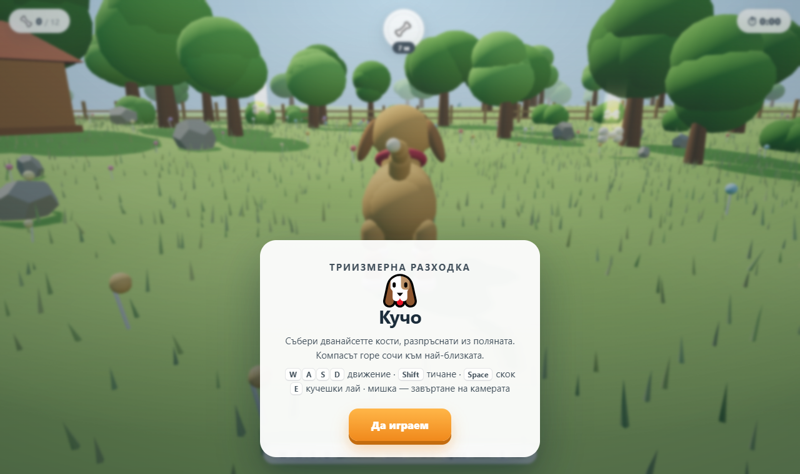

# 🐶 Кучо

Малка 3D игра, която върви направо в браузъра. Кученце тича из поляна и събира
дванайсет кости. Компасът горе сочи към най-близката.



## Как се играе

| Клавиш | Какво прави |
|---|---|
| `W` `A` `S` `D` | движение |
| `Shift` | тичане |
| `Space` | скок |
| `E` | кучешки лай |
| мишка | завъртане на камерата |

На телефон: пръст отляво за движение, пръст отдясно за камера.
Копчетата долу са лай, тичане и скок.

## Какво има вътре

- Целият свят е сглобен от прости фигури — няма нито един външен 3D модел.
- Теренът е процедурен: хълмове, езеро с тръстика, гора.
- Водата, тревата и стълбовете светлина имат собствени шейдъри
  (вълнички, люлеене от вятър, меко сияние).
- Звукът се синтезира в момента — лай, стъпки, птички, вятър. Няма звукови файлове.
- Кучо мига, диша, маха с трите части на опашката си и сгъва колене, докато тича.
- Three.js е свален локално, затова играта тръгва и без интернет.

## Файлове

| Файл | Какво е |
|---|---|
| `index.html` | страницата |
| `game.js` | цялата игра |
| `style.css` | изгледът |
| `vendor/three.min.js` | Three.js r149 |
| `screenshot.png` | снимка за това описание |

## Пускане

Отвори `index.html` с двоен клик. Толкова.

Ако искаш да го пуснеш като сървър (например за телефон в същата мрежа):

```bash
python -m http.server 8000
```

После отвори `http://<ip-на-компютъра>:8000` на телефона.

## Лиценз

Играта е с MIT. Three.js си има собствен лиценз — виж `vendor/three.min.js`.
